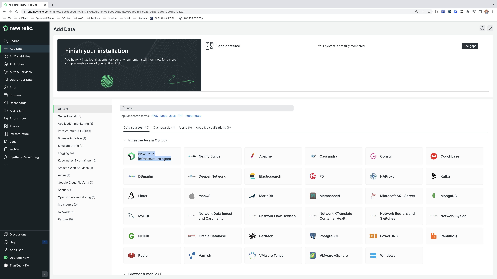
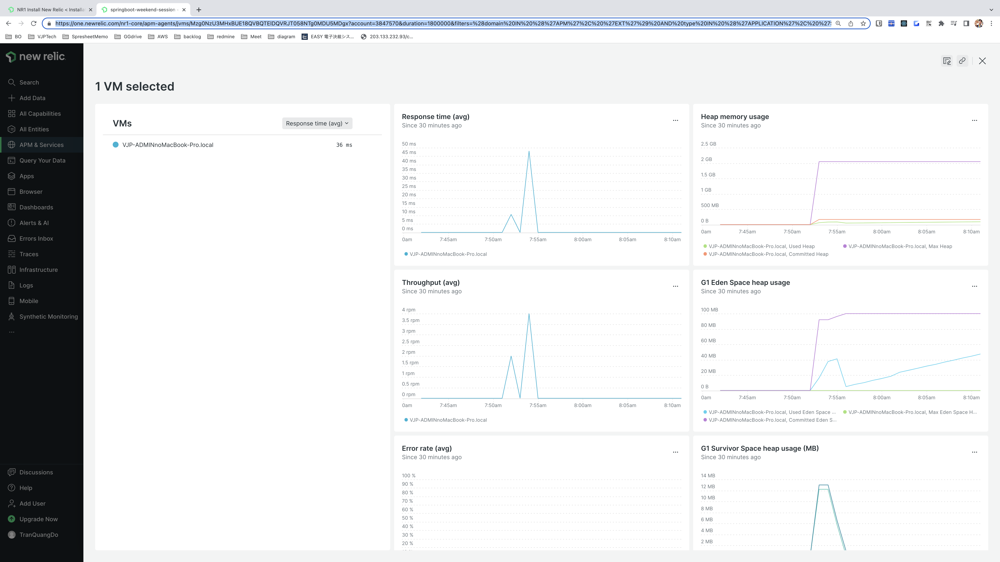

# newrelic-demo 🐳


[](https://github.com/tquangdo/newrelic-demo/issues/new)

## reference
- [youtube1](https://www.youtube.com/watch?v=QX7wMf6wTSU)
- [youtube2](https://www.youtube.com/watch?v=xDJMZyToIag)
- [youtube3](https://www.youtube.com/watch?v=rVVvWHT_By4)
- [youtube4](https://youtu.be/RKaEt26HjhI)

## yt1
1. ### create acc
    - create acc with 1 email
    - access `https://one.newrelic.com/` > click `Apps` > `Build your own New Relic apps`
    
    - install
    
    - (re)start/stop/uninstall infrastructure agent
    ```shell
    #(re)start/stop
    brew services (re)start/stop newrelic-infra-agent
    #uninstall
    brew uninstall newrelic-infra-agent
    ``` 
1. ### create app
    ```shell
    # 1/
    nr1 --version
    #@datanerd/nr1/2.83.5 darwin-x64 node-v16.11.1

    # 2/
    sudo nr1 profiles:add --name account-3847570 --api-key NRAK-XXX --region us
    # Password:
    # ✔  Added profile account-3847570.

    # 3/
    nr1 create                                                                                         
    #✔ What kind of component do you want to create? › nerdpack
    #✔ Name your nerdpack. … cooing-metal
    #✔ Name your nerdlet. … home
    #✔ Name your launcher. … launcher
    #Installing dependencies...
    #added 8 packages, and audited 9 packages in 964ms
    #found 0 vulnerabilities
    # ✔  nerdpack created successfully!
    #    nerdpack cooing-metal is available at "./"
    # ✔  nerdlet created successfully!
    #    nerdlet home is available at "./nerdlets/home"
    # ✔  launcher created successfully!
    #    launcher launcher is available at "./launchers/launcher"
    ```
1. ### run app
    ```bash
    cooing-metal$ npm start
    #✔  Server ready! Test it at: https://one.newrelic.com/?nerdpacks=local
    #↩  Server will reload automatically if you modify any file!
    #ℹ  Additionally, you can test the following artifacts at:
    #Launchers:
    #⁎  launcher https://onenr.io/0Zw0v4brNjv
    ```
    - if err `permission denied` then solve by `sudo chmod -R 777 /Users/do.tranquang/.newrelic`
    - access `https://one.newrelic.com/?nerdpacks=local` on browser
    
    - access `https://onenr.io/0Zw0v4brNjv` on browser
    
    - access `https://one.newrelic.com/catalog/app-directory?nerdpacks=local&account=3847570` on browser
    

## yt2
1. ### install
    - NRl dashboard: click `+ Add Data` > search with KW `infra` > choose `New Relic infrastructure agent`
    
    ```shell
    curl -Ls https://download.newrelic.com/install/newrelic-cli/scripts/install.sh | bash && sudo NEW_RELIC_API_KEY=NRAK-XXX NEW_RELIC_ACCOUNT_ID=3847570 /usr/local/bin/newrelic install
    #==> Successfully started `newrelic-infra-agent` (label: homebrew.mxcl.newrelic-infra-agent)
    #Running agent status check attempt...
    #Agent status check ok.
    #✔ Installing Infrastructure Agent
    #Installed 
    #New Relic installation complete 
    #--------------------
    #Installation Summary
    #✔  Infrastructure Agent  (installed)  
    #View your data at the link below:
    #⮕  https://onenr.io/0LREdy6Yrwa
    ```
1. ### run
    - access `https://onenr.io/0LREdy6Yrwa` on browser
    
    - or in another way, click `See your data` (can check log in the right panel)
    

# spring boot + new relic
1. ## yt3
    1. ### PRJ1: springboot-weekend-session
        1. #### git clone PRJ1
            ```shell
            cd springboot-weekend-session
            mvn clean install
            #[INFO] ------------------------------------------------------------------------
            #[INFO] BUILD SUCCESS
            #[INFO] ------------------------------------------------------------------------
            #[INFO] Total time:  12.619 s
            #[INFO] Finished at: 2023-03-12T16:20:54+09:00
            ```
        1. #### create APM
            - NRl dashboard: click `APM & Services` > click `Add data` > search with KW `java` > choose `Maven`
            
            ```shell
            springboot-weekend-session$ curl -O https://download.newrelic.com/newrelic/java-agent/newrelic-agent/current/newrelic-java.zip
            unzip newrelic-java.zip
            ```
            - input PRJ name & license key and click `Download` for `newrelic.yml`
            - license key can see here
            
            - copy paste `newrelic.yml` DL file into `springboot-weekend-session/newrelic/newrelic.yml`
        1. #### run
            ```shell
            springboot-weekend-session$ java -javaagent:/Users/do.tranquang/Documents/DoTQ/FE/gitlab/newrelic-demo/springboot-weekend-session/newrelic/newrelic.jar -jar target/springboot-weekend-session-0.0.1-SNAPSHOT.jar
            # /\\ / ___'_ __ _ _(_)_ __  __ _ \ \ \ \
            #( ( )\___ | '_ | '_| | '_ \/ _` | \ \ \ \
            #\\/  ___)| |_)| | | | | || (_| |  ) ) ) )
            #'  |____| .__|_| |_|_| |_\__, | / / / /
            #=========|_|==============|___/=/_/_/_/
            #:: Spring Boot ::        (v2.3.2.RELEASE)
            #2023-03-12 16:52:14.718  INFO 20055 --- [           main] .c.s.SpringbootWeekendSessionApplication : Starting #SpringbootWeekendSessionApplication v0.0.1-SNAPSHOT on VJP-ADMINnoMacBook-Pro.local with PID 20055 (/Users/do.#tranquang/Documents/DoTQ/FE/gitlab/newrelic-demo/springboot-weekend-session/target/springboot-weekend-session-0.0.#1-SNAPSHOT.jar started by do.tranquang in /Users/do.tranquang/Documents/DoTQ/FE/gitlab/newrelic-demo/#springboot-weekend-session)
            #2023-03-12 16:52:14.725  INFO 20055 --- [           main] .c.s.SpringbootWeekendSessionApplication : No active #profile set, falling back to default profiles: default
            #2023-03-12 16:52:15.347  INFO 20055 --- [           main] o.s.b.w.embedded.tomcat.TomcatWebServer  : Tomcat #initialized with port(s): 33333 (http)
            #2023-03-12 16:52:15.403  INFO 20055 --- [           main] o.apache.catalina.core.StandardService   : Starting #service [Tomcat]
            ```
            - port `33333` in `springboot-weekend-session/src/main/resources/application.properties`
            - access `localhost:33333/getalldevopstools` (from `springboot-weekend-session/src/main/java/com/companyname/controller/AwsDevopsController.java`) on browser and F5 `APM & Services` on NRl dashboard
            
            - click on `springboot-weekend-session` APM > click `Monitor>Distributed tracing`
            
            - click `JVMs>VJP-ADMINnoMacBook-Pro.local`
            
    1. ### PRJ2: hellospringboot-cicdWithHelm
        1. #### git clone PRJ1
            ```shell
            cd hellospringboot-cicdWithHelm
            ```
        1. #### edit newrelic.yml
            - edit `springboot-weekend-session/newrelic/newrelic.yml`
        1. #### run
            ```shell
            hellospringboot-cicdWithHelm$ java -javaagent:/Users/do.tranquang/Documents/DoTQ/FE/gitlab/newrelic-demo/springboot-weekend-session/newrelic/newrelic.jar -jar target/hello-0.0.1-SNAPSHOT.jar
            ```
            - access `localhost:8080/hello` (from `hellospringboot-cicdWithHelm/src/main/java/com/spjenk/hello/HelloController.java`) on browser
            
            - F5 `APM & Services` on NRl dashboard
            

1. ## create PRJ from vscode extension
    1. #### PRJ: demo1
        - `demo1/pom.xml`: `demo1$ mvn clean install`
        ```xml
        <dependency>
			<groupId>com.newrelic.agent.java</groupId>
			<artifactId>newrelic-agent</artifactId>
			<version>5.13.0</version>
		</dependency>
        ```
    1. #### edit newrelic.yml
        - edit `springboot-weekend-session/newrelic/newrelic.yml`
    1. #### run
        ```shell
        demo1$ java -javaagent:/Users/do.tranquang/Documents/DoTQ/FE/gitlab/newrelic-demo/springboot-weekend-session/newrelic/newrelic.jar -jar target/demo1-0.0.1-SNAPSHOT.jar
        ```
        - access `localhost:8080/exampleone` on browser
        
        - F5 `APM & Services` & check in tab `Logs` on NRl dashboard
        

## yt4
1. ### connect k8s
    - on NRl dashboard click `Kubernetes` > `Add data` > choose `Kubernetes`
    
    ```shell
    curl -Ls https://download.newrelic.com/install/newrelic-cli/scripts/install.sh | bash && NEW_RELIC_CLI_SKIP_CORE=1 NR_CLI_CLUSTERNAME=minikube_dotq NR_CLI_NAMESPACE=newrelic NR_CLI_PRIVILEGED=true NR_CLI_LOW_DATA_MODE=true NR_CLI_KSM=true NR_CLI_KUBE_EVENTS=true NR_CLI_PROMETHEUS_AGENT=true NR_CLI_PROMETHEUS_AGENT_LOW_DATA_MODE=true NR_CLI_CURATED=false NR_CLI_NEWRELIC_PIXIE=true NR_CLI_PIXIE_API_KEY=px-api-XXX NR_CLI_PIXIE=true NR_CLI_PIXIE_DEPLOY_KEY=px-dep-XXX NEW_RELIC_API_KEY=NRAK-XXX NEW_RELIC_ACCOUNT_ID=3847570 /usr/local/bin/newrelic install -n kubernetes-open-source-integration
    ```
    
1. ### view k8s dashboard
    - on NRl dashboard click `Dashboard` & `Kubernetes`
    
    - check pod/deployment/svc name are same with k8s CLI
    
    - note: if `minikube delete` then on NRl dashboard click `Kubernetes` > click cluster `minikube_dotq` will show this warning
    


